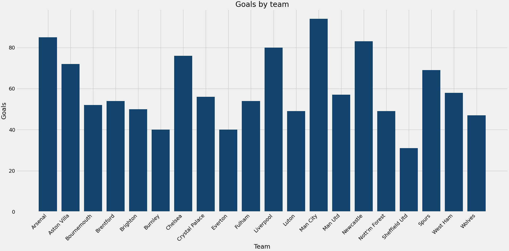

# speedy-charts

## Description
This package is designed to make simple plotting easier, applying a logical syntax to a matplotlib backend!

The following chart types are supported: Bar, Line, Scatter, Stacked Bar, Horizontal Stacked Bar, Grouped Bar

## Installation
To install the package, run the following code in the terminal:
```terminal
pip install 
```
Or run an equivalent command for your package manager of choice, for example in poetry:
```terminal 
poetry add
```

## Usage
### Importing the package
To use the package you should use the following import statements at the top of your script:

```python
import matplotlib
matplotlib.use('TkAgg')
import matplotlib.pyplot as plt

from speedy_charts.charts import Bar, Scatter, StackedBar, HorizontalStackedBar, GroupedBar, Line
from speedy_charts.palettes import af_categorical
```

You can choose to only specify the charts and palettes htat you need for your specific task.

The ```matplotlib.use('TkAgg')``` ensures that the plots can be displayed interactively.

### General usage guidance
The package syntax is based around two elements:
1. The chart object - here, you specify arguments relating to the data that goes into the chart
2. The plot method - here, you specify arguments relating to the visual aspects of the chart

The chart object for example, contains arguments relating to the dataframe you are plotting from, x/y axis values and categorisation if applicable.

The plot method on the other hand, contains arguments relating to colour palette, title, x/y axis labels and legend.

You can also apply any additional transformations to the chart that aren't included in the plot method using standard matplotlib pyplot methods.

**__Please note, you can recreate all of the dataframes used in the example code by running the code in '[Dataframes for chart examples](...)' section below.__**

### Bar
#### Basic Bar
For a basic bar chart, you need to provide, x and y axis values and the dataframe in the chart object.

All other arguments, including those in the plot method are optional, however axis labels and a title are recommended at a minimum.

```python

```



This code creates a basic bar chart, but also includes a transformation using a standard matplotlib method 'xticks' to rotate the x-axis labels.


#### Applying categorical colours
You can also add category arguments to a standard bar chart to colour the bars by a categorical or numeric variable:
* If using a categorical column, this can be achieved by providing the 'category_column' arguments
* If using a numeric column, this can be achieved by providing the 'category_column', 'category_list' and 'custom_ranges' arguments

```python

```


In this example, the 'custom_ranges' argument specifies the ranges of the category_column that the colours will correspond to and the 'category_list' argument provides names for the ranges.
Please note that the 'category_list' is always one element smaller than the 'custom_ranges', list.

### Grouped Bar
A grouped bar chart takes the same arguments as a standard bar chart but requires multiple y-axis values passed as a list.

```python

```


### Stacked Bar
A stacked bar chart takes the same arguments as a standard bar chart but requires multiple y-axis values passed as a list, similar to the grouped bar.

```python

```


### Horizontal Stacked Bar
A horizontal stacked bar chart takes the same arguments as a standard bar chart but requires multiple y-axis values passed as a list, similar to the grouped bar and stacked bar.
